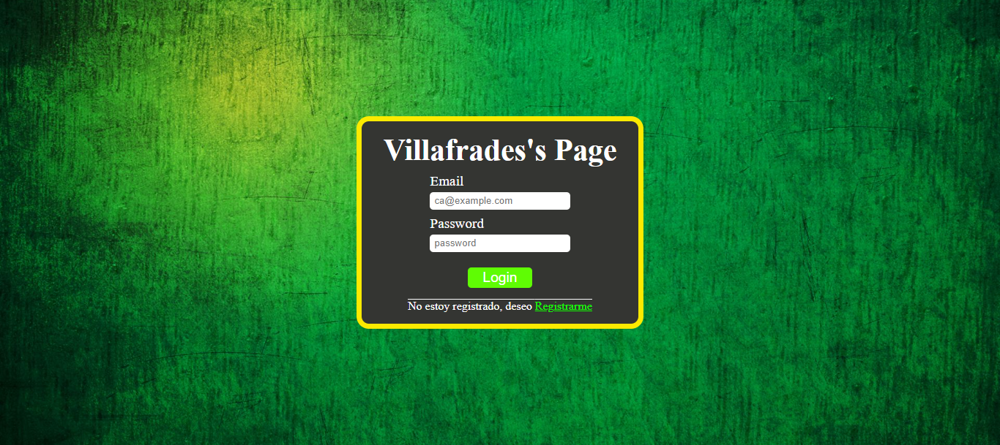

# Proyecto Log in

Se creo un proyecto donde realizamos un LOGIN funcional, con su apartado de registro y manejando la privatizacion de rutas y las rutas no encontradas (NOT FOUND)

- Al ingresar a la pagina nos contraremos con el apartado de Login

- En caso de no contar con un email y una constraseña, debemos dirigirnos a la parte de registrarnos y proceder  a registrarnos.

- Una vez podamos registrarnos satisfactoriamente, debemos loguearnos con el Email y Password registrados.

- Una vez se valide que el Email y la Password son correctas, nos dejarà pasar a la seccion de Home, donde nos recibira un mensaje personalizado.

## A TENER EN CUENTA

- Si no estamos logueados no vamos a poder ingresar a la seccion del home

- si ya pudimos loguearnos y entrar a la seccion del home, no vamos a poder volver a dirigirnos a la seccion de logue y a la seccion de registro a menos de que nos hallamos deslogueado con el boton de LOGOUT

- Si colamos en la URL una Ruta que no existe esta nos dirigira a nuestra pagina de NOT FOUND

## CONTACT

Nombre: Carlos Villafrades Pinilla

Email: cavillafrades@gmail.com